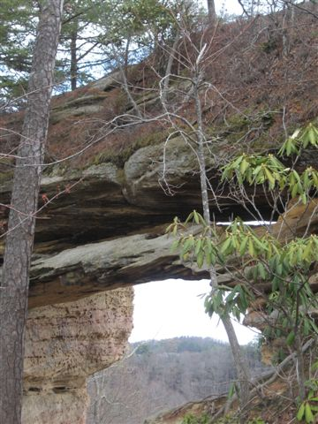

# Field Report
Bryan Gordon
November 11, 2018
Red River Gorge

Double Arch
The Double Arch is an arch that contains two arches, one succeeding another. Lithology of upper arch is more durable than the lower arch. Perimeter of the Double Arch is around 400-450 ft and has an area close to 9500-10,0000 square feet. Base map was accurate, hillshade resolution has low resolution, therefore data/GPS coordinates usually led to the general area. 

