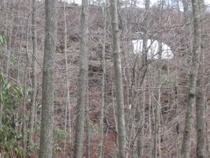
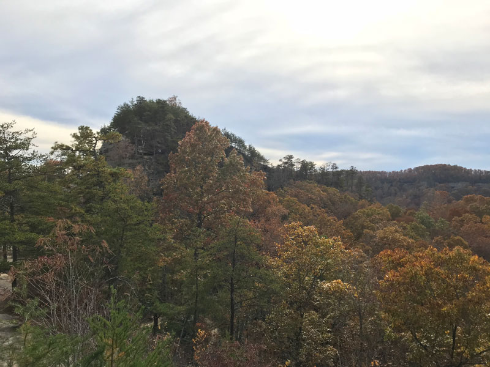
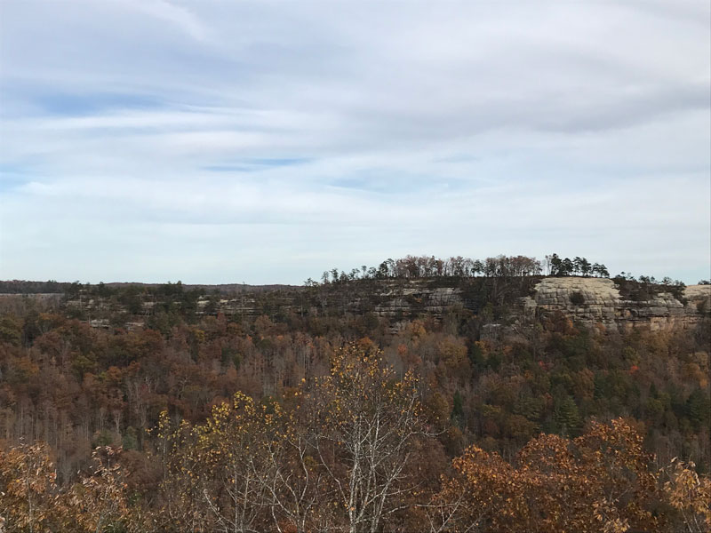

# rrg

Red River Gorge, Kentucky

## A project that explores Double Arch

### Locator map

*(Source: lab 9)*

### Summary information 

The Red River Gorge is located inside of the Daniel Boone National Forest and has an area of around 29,000 acres. The geological area is a canyon system that is a part of Central Kentucky.

How high is Double Arch? Use ArcGIS Pro to measure its height

*(Source: three paragraphs developed in labs 1, 5, and 9)*

### Bird's-eye view animation

* [video](#)

*(Source: one video made in lab 7)*

### Maps 

* [Base map of popular Red River Gorge arches](basemap/rrg.pdf) *(lab 5)*
* [Cliffs over 40 feet](#) *(lab 7)*

### Web pages 

* [Welcome to the Red River Gorge](../index.html) *(lab 1)*
* [Explore the arch](#) *(lab 8)*

### Photographs

     
caption

     
caption

     
caption

     
caption

     
caption

     
caption

*(Source: five photographs made in lab 5)*

## Final project 

For a super-polished version of final project, you should add content to your two web pages.

The lab 1 [Welcome to the Red River Gorge](../index.html) web page needs to have the following assets added:

* [Base map of popular Red River Gorge arches](basemap/rrg.pdf) *(lab 5)*
* A link to the [Explore the arch](#) *(lab 8)* web page

The lab 8 [Explore the arch](#) *(lab 8)* web page needs to have the following assets added:

* [video](#) (lab 7)*
* [Cliffs over 40 feet](#) map *(lab 7)*
* Photographs *(lab 5)*
* Summary information/narrative about arch that includes measures of landform, e.g., height, width, etc. 
